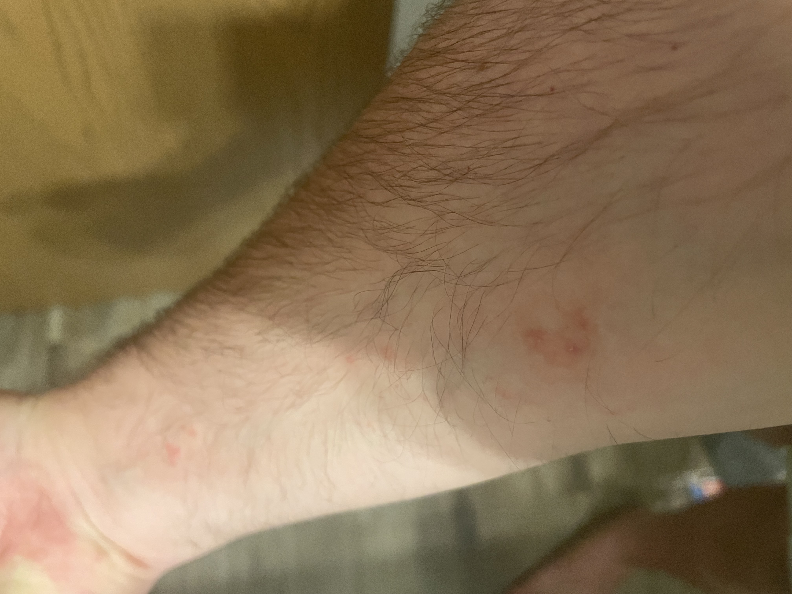
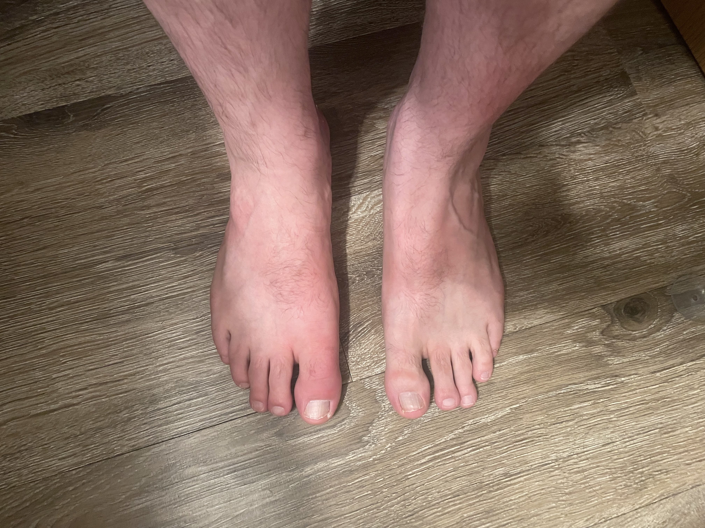

# Medical documentation of stress-induced health effects

## Timeline Correlation to Harassment

Both medical conditions developed during the harassment period (July 18, 2025) and were photographed within days of onset as evidence of the physical impact of the psychological terrorism campaign.

### Hives (Stress-Related Dermatitis):
**Onset**: July 19, 2025 - during harassment campaign   
**Location**: Right arm  
**Correlation**: Appeared directly during peak harassment hours
**Baseline**: No hives episodes in decades, establishing clear stress causation

### Gout (First-Ever Attack):
**Onset**: July 19, 2025 - during harassment campaign  
**Impact**: Excruciating pain and mobility limitations  
**Significance**: First gout attack in victim's life, directly correlating to stress
**Baseline**: No previous history of gout in decades of life, establishing clear causation

## Psychological and Behavioral Impact

### Sleep Disruption and Hypervigilance
**Onset**: Immediately following harassment campaign (July 18-19, 2025)
**Duration**: Ongoing since harassment incident
**Symptoms**: 
- Severe sleep disruption - difficulty falling asleep due to intrusive thoughts about threats
- Frequent nighttime awakening with anxiety about home security
- Hypervigilance regarding personal safety and family protection
- Constant mental replay of harasser's demands for home address

### Panic Episodes and Security Anxiety
**Critical Incident**: During the harassment aftermath, while using the restroom, I received a notification that my security camera was no longer available. This triggered an immediate panic response, as the timing seemed potentially coordinated with the harassment campaign and the harasser's explicit demands for my home address.

**Ongoing Security Concerns**:
- Heightened anxiety about home surveillance and security systems
- Compulsive checking of security camera functionality
- Fear that technology failures may be related to surveillance or stalking
- Increased concern about family safety when away from home
- Involuntary startle responses to unexpected notifications or alerts

### Daily Life Disruption
**Work Impact**: Difficulty concentrating due to persistent anxiety about potential escalation
**Social Impact**: Reluctance to discuss the incident due to fear of additional targeting
**Family Impact**: Increased protective measures and security protocols for family members
**Technology Anxiety**: Heightened concern about digital security and surveillance

### Institutional Distrust and Medical Impact
**Filing-Related Anxiety**: Fear of potential law enforcement retaliation for filing federal complaints has created secondary psychological trauma manifesting as:
- Persistent anxiety about police encounters and traffic stops
- Conserns regarding surveillance and monitoring
- Sleep disruption from concerns about coordinated harassment
- Elevated stress levels affecting existing medical conditions

**Corruption-Related Stress**: Concerns about potential collusion between PPD and harassment suspect based on inexplicably hostile treatment creates ongoing psychological distress including:
- Chronic anxiety about lack of local law enforcement protection
- Increased isolation due to institutional distrust
- Compounded trauma from feeling abandoned by protective systems

## Medical Significance

These physical manifestations and psychological symptoms provide comprehensive evidence of the severe trauma inflicted by the coordinated intimidation campaign. The combination of:
- **Physical symptoms** (stress-induced gout and hives)
- **Sleep disruption** (ongoing insomnia and hypervigilance) 
- **Panic responses** (security system anxiety)
- **Behavioral changes** (increased protective measures)
- **Federal filing anxiety** (fear of police department retaliation)
- **Institutional distrust** (concern about weaponization of local law enforcement)

...demonstrates the criminal impact extends far beyond the initial harassment, creating lasting psychological trauma that supports enhanced charges reflecting serious bodily harm and ongoing psychological terrorism. The additional layer of fear regarding potential law enforcement retaliation for seeking federal protection creates a secondary victimization that compounds the original trauma and demonstrates the systemic nature of the constitutional violations.

## Scientific Literature Supporting Stress-Induced Medical Conditions

**Harassment-Induced Health Effects Research:**
- Cohen, S., et al. (2007). "Psychological stress and disease." *JAMA*, 298(14), 1685-1687. Documents direct correlation between psychological stress and inflammatory conditions including dermatitis and gout.
- Kiecolt-Glaser, J.K., et al. (2002). "Psychoneuroimmunology and psychosomatic medicine." *Psychosomatic Medicine*, 64(1), 15-28. Establishes biological pathways between psychological trauma and immune system dysfunction leading to stress-related dermatological conditions.
- Singh, J.A., & Cleveland, J.D. (2018). "Gout and the risk of incident depression, anxiety and stress." *Arthritis Research & Therapy*, 20(1), 14. Documents bidirectional relationship between stress and gout attacks, supporting stress as a precipitating factor.

**Legal Medical Documentation Standards:**
The immediate temporal correlation between harassment and symptom onset, combined with absence of previous episodes, establishes clear causation meeting legal standards for serious bodily harm in criminal cases.